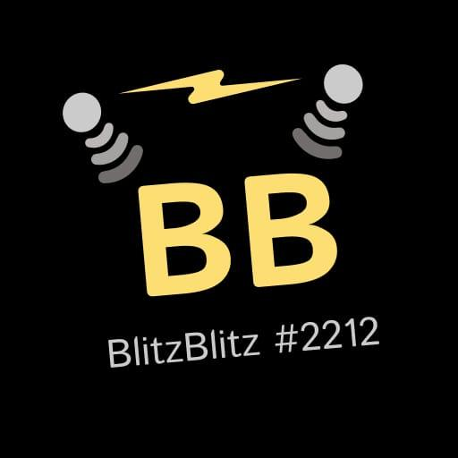

# BlitzBlitz #2212 Robot 2025 

<div align="center">
  <a href="https://github.com/BlitzBlitz2212/BlitzBlitzBot2025/">
    
  </a>
</div>

Welcome to the **BlitzBlitz #2212** repository! This is a collaborattion for the FLL 2025 Submerged Challenge Off-Season, bringing together **PetroBlitz #841**, **PandaBlitz #994**, and **StarBlitz #840**.

## Setup

1. Clone the repository:  
   `git clone https://github.com/BlitzBlitz-2212/robot-2025-submerged.git`
   
2. Create a virtual environment:  
   `python -m venv .venv`

3. Install dependencies:  
   `pip install -r requirements.txt`

4. Set the `HUB_NAME` variable in `pybrickslaunch.py`.

## Usage

1. Open the Python file you want to run.
2. Go to "Run and debug" in VS Code.
3. Choose the "Pybricks: Current File" run configuration.
4. Click the play button to upload and run the code on the PyBricks hub.

## Repository Structure

```
BlitzBlitz-2025/
│
├── pybrickslaunch.py         # Uploads code to PyBricks hub
├── robot.py                  # Robot’s main logic
├── requirements.txt          # Python dependencies
├── .vscode/                  # VS Code integration settings
```

